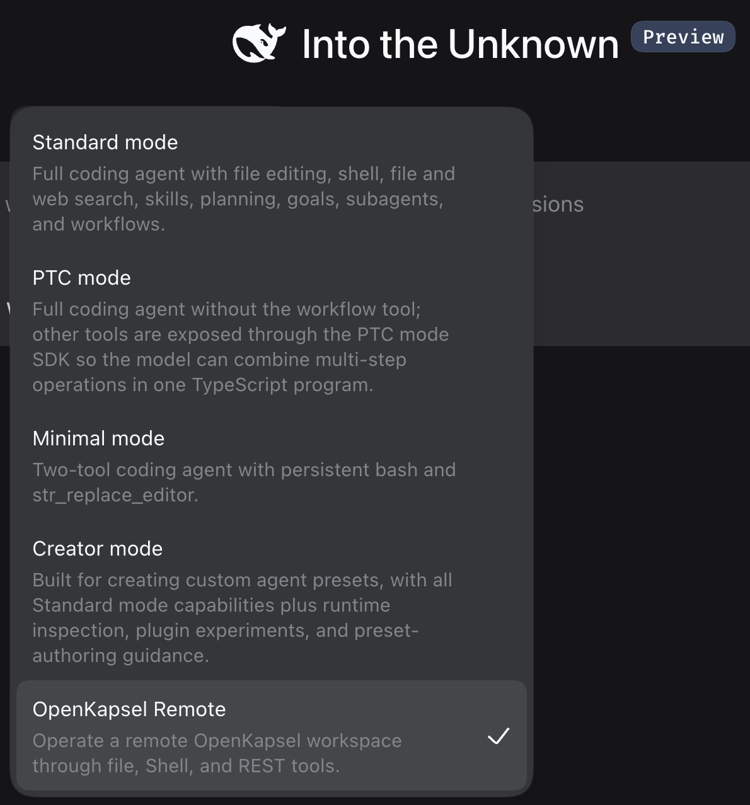

# dsh-openkapsel

[](https://dsh-plugin.org/plugins/zzzmmmnn/dsh-openkapsel)

OpenKapsel workspace bridge for the **DeepSeek Harness**. It turns a remote
OpenKapsel workspace into model-visible tools: supply the read-only workspace
URL ending in `/w/<READ_TOKEN>` and its matching control token, and the agent
can list/read/write files, run Shell tasks, and call the other OpenKapsel REST
surfaces. The model has no host filesystem or host Shell tool in the bundled
remote-only preset.

The bridge reuses the workspace-published `openkapsel-rest` skill's Python
helpers (`openkapsel_http.py` and `openkapsel_config.py`), vendored under
`skill/`. Each `kapsel_*` tool invokes one of those two fixed scripts through
the harness host Shell service. The model cannot choose the script or use that
service as a Shell tool. Authentication, Context attribution
(`plan_id`/`taskname`/`message`), REST error decoding, and credential renewal
stay owned by the maintained skill code. Every helper subprocess receives an
explicit DSH `workspace-write` policy rooted at that agent's private state
directory; the executor also controls any platform temporary-directory access.

## Compatibility and permissions

| Area | Requirements and scope |
|---|---|
| DSH | Tested with DSH `0.1.2-rc.1`, the `web` profile, and the bundled **OpenKapsel Remote** preset. Other profiles are not verified. |
| Node.js | Package declares `>=18`; the test matrix covers Node.js 22 and 24. Use a version supported by your DSH installation; Node.js 18 is not covered by this project's CI. |
| Python | Python 3.10+ on the Host's `PATH`: `python` on Windows, `python3` on macOS/Linux. The test matrix covers 3.10 and 3.14. |
| Host platform | macOS/Linux use DSH's Bash executor; Windows uses DSH's PowerShell executor without Bash. GitHub installation and Host startup verified on macOS. Windows installation and actual plugin use confirmed by user testing (2026-09-09). Linux/Windows automated tests are configured in CI. |
| External service | Requires a reachable, user-selected OpenKapsel Server and its Workspace URL/control token. Requests and their supplied file contents or commands are sent to that server. |
| Local access | Runs fixed Python helpers through DSH's Shell service and writes session credentials under `$DSH_HOME/state/dsh-openkapsel` (default `~/.dsh/state/dsh-openkapsel`). Model-facing host file/Shell tools and `run_code` are denied. |
| Credentials | Stores the read URL and control token under the user's DSH state directory. Unix uses `0600` files and `0700` directories; Windows relies on the containing user directory's ACL (chmod does not enforce Unix permissions there). Automatic renewal may replace stored credentials. |
| Remote permissions | Can read, modify, and run Shell commands within the remote token's grants. Typed tools are conveniences; the server enforces authorization for generic REST calls too. |
| DSH policy | `read-only` denies remote mutations and Shell; a one-call approval may authorize a retry. `workspace-write` and `danger-full-access` both remain bounded by the remote token. |
| License | [MIT](LICENSE). This is a community plugin, not an official DeepSeek product. |

## Why the internal transport remains Python

An installed Cordis package could implement the transport in Node. This bridge
keeps Python because the existing helpers already own renewal, authentication,
error decoding, and Context merging. Reusing them avoids a second protocol
implementation that could drift as OpenKapsel evolves. This does not grant the
model a local Shell: script paths are plugin-owned constants and arguments
travel as JSON on stdin to a fixed Python bootstrap.

Requires `python` on Windows or `python3` on macOS/Linux on `PATH`.

## Layout

```text
index.js                Host-side Cordis plugin and typed remote tools
bundle.js               Profile bootstrap that installs only the preset
cordis.patch.yml        DSH bundle entry point (no global tool guard)
preset-install.js       Shared, update-safe preset installer
skill/openkapsel-rest/  Vendored REST skill and fixed Python helpers
preset/kapsel/          Remote-only agent preset shown in DSH's mode picker
bin/install-preset.js   Installs the preset into the DSH user preset root
cordis.example.yml      Annotated bridge row
tests/                  Tool-catalog and remote-isolation tests
```

## Install

Install from GitHub into the DSH `web` profile:

```bash
dsh plugin --profile web add github:zzzmmmnn/dsh-openkapsel
```

No manual symlink or local source checkout is required. DSH manages the package
as a profile dependency. Its `dsh.bundle` patch loads a lightweight bootstrap
when the profile starts. The bootstrap installs the OpenKapsel Remote preset;
it does not register tools, enable the remote-only guard, or change the default
preset. Tools and the guard load only when you select OpenKapsel Remote.

Untouched package-managed presets update automatically on startup. Existing
identical manual installations are adopted. Locally modified presets are
preserved and reported instead of overwritten. To explicitly replace one:

```bash
dsh plugin --profile web exec dsh-openkapsel-install-preset --force
```

The target is `$DSH_HOME/.agent-presets/kapsel`, or
`~/.dsh/.agent-presets/kapsel` when `DSH_HOME` is unset. Restart DSH. New sessions can then
select **OpenKapsel Remote** beside the shipped modes. Existing non-empty
sessions keep their original preset. Supply your OpenKapsel Workspace URL and
matching control token through `kapsel_config` to connect the remote workspace.

The installer command without `--force` remains available for manual setup.
Removing the package does not delete the copied preset or session credentials.
After uninstalling, remove `$DSH_HOME/.agent-presets/kapsel` if no other profile
uses it. The preset root is shared by profiles using the same `DSH_HOME`.

Version 0.7.0's packed bundle was installed into a fresh temporary DSH profile
on macOS: profile composition, Web Host startup, and automatic preset creation
passed without changing the default `standard` preset. The new bootstrap also
has automated installation, update, customization-preservation, and isolation tests.

The earlier GitHub installation and profile-scoped installer were verified locally;
the installed package passed its tests and the DSH web Host started
successfully on macOS. Windows installation and actual plugin use were also
confirmed by user testing on 2026-09-09. On Windows, run these same commands from PowerShell;
ensure `python --version` resolves to Python 3.10 or newer. Bash is not required.

## Remote-only preset

Select **OpenKapsel Remote** in the DSH preset picker:



Do not add `dsh-openkapsel` to `standard` or `minimal`: both expose host-local
tools. The bundled preset intentionally omits host Bash/PowerShell,
filesystem/search/editor, job control, local `AGENTS.md` discovery, and local
skill discovery. It retains only the OpenKapsel bridge plus `skill`,
`ask_user_question`, and `todo_write`.

The plugin also installs a fail-closed tool guard. Accidentally composing an
undeclared or local tool therefore causes execution to be denied even if a
future preset edit makes that tool visible to the model. DSH's optional
`run_code` presentation transport is denied. Remote-only mode explicitly selects
native tools, so model-authored code is not executed through a host code runtime.

### DSH sandbox-mode mapping

The bridge resolves the current policy from `ctx.sandboxPolicy` for every tool
call:

| DSH mode | Remote OpenKapsel behavior |
|---|---|
| `read-only` | Allows configuration, status, Discovery, filesystem reads, and generic `GET`/`HEAD`; denies remote mutations and Shell execution |
| `workspace-write` | Allows every capability granted by the OpenKapsel token |
| `danger-full-access` | Same bridge behavior as `workspace-write`; it never widens the OpenKapsel token |

A denied mutation can be retried with a one-call approval request:

```json
{
  "sandbox_permissions": "workspace-write",
  "justification": "Update the requested remote configuration file once."
}
```

The plugin delegates the request to DSH's approval service before contacting
the remote mutation endpoint. Approval does not change the session's durable
sandbox mode. Rejection, cancellation, a missing approval channel, malformed
fields, and non-widening requests all fail closed.

The bridge row inside the bundled preset is:

```yaml
- id: tool-kapsel
  name: 'dsh-openkapsel'
  config:
    taskname: dsh
    enforceRemoteOnly: true
```

`dsh-openkapsel` consumes the host `shell`, `tools`, `skills`, and `sandboxPolicy` services and
publishes none. Mount it in the dedicated agent preset, not globally.

## Usage

1. `kapsel_config(workspace_url, control_token)` stores credentials in this
   DSH session's private plugin state, then selects or creates an active root
   Plan for mutation attribution. Re-run it to switch workspaces or rotate
   credentials.
2. `skill("openkapsel-rest")` loads the authoritative REST reference before
   nontrivial operations.
3. Operate through the remote tools:

| Tool | Purpose |
|---|---|
| `kapsel_config` / `kapsel_status` | Configure or inspect the active workspace |
| `kapsel_plan_update` | Update, reparent, cancel, or complete a Plan with a structured debrief |
| `kapsel_fs_list` / `kapsel_fs_read` / `kapsel_fs_stat` | Read-side filesystem |
| `kapsel_fs_write` / `kapsel_fs_replace` | Remote text write/edit |
| `kapsel_shell_exec` / `kapsel_task_output` | Run and poll a remote Shell task |
| `kapsel_http` | Context, Memory, sharing, preview, schedules, and other REST surfaces |

`kapsel_http.json` is always a JSON object. Endpoint fields belong inside it,
not beside it. Context-management endpoints are handled specially because
their `plan_id` fields describe the Context graph rather than ordinary
operation attribution; prefer `kapsel_plan_update` for Plan changes.

Each DSH agent is keyed separately by `agent.id`. Credentials live under
`$DSH_HOME/state/dsh-openkapsel/<sha256(agent.id)>/.openkapsel.env`; active Plan and
taskname values are held in an agent-keyed `WeakMap`. The local project cwd is
not used for credentials or remote-workspace selection. An absolute `stateDir`
plugin option can replace the default private state root.

For a recorded mutation, `taskname` is resolved from the current tool call,
then the selected active Plan/session value, then the value set by
`kapsel_config`, then the plugin's preset configuration, and finally `dsh`.
Empty and whitespace-only values do not suppress this fallback. The active
Plan is selected automatically when `plan_id` is omitted; selecting a
persisted Plan after a Host restart also restores that Plan's taskname. A
missing or blank `message` receives a short default operation message.

## Security notes

Typed tools are convenience wrappers, not an additional permission boundary.
`kapsel_http` exposes the REST surfaces available to the selected credential;
the remote server enforces endpoint, path, and capability authorization. DSH
read-only mode additionally denies mutating HTTP methods and Shell execution.
This assumes that GET/HEAD endpoints honor read semantics; project application
routes implement their own behavior and authorization.

The current DSH Shell service accepts a command string, not an argv array.
The bridge sends helper paths and arguments as ASCII JSON on stdin to a fixed
Python bootstrap. Model input never enters the Host Shell command text. NUL
arguments are rejected. Generated tests round-trip quotes, newlines,
substitutions, backslashes, empty strings, and Unicode through Bash on Unix and
PowerShell 7/Windows PowerShell 5.1 on Windows. Helpers retain their DSH sandbox
policy, and their exit codes propagate through PowerShell.

Version 0.5.0 renames the package, installer command, and default state directory
to `dsh-openkapsel`. Reinstall the preset and initialize credentials again after
upgrading. To reuse an existing private state directory, explicitly configure
`stateDir` to that directory. Tool names (`kapsel_*`) and the `kapsel` preset ID
remain stable.

## Development checks

Run `npm ci` and `npm test`. GitHub Actions checks Node.js 22/24 with Python
3.10/3.14 on Linux and Windows, including helper argument round-trip and remote
permission tests.

## Operational notes

- The control token is stored only in the session-private credential file with
  Unix mode `0600` (Windows uses inherited directory ACLs). Neither the token nor its host-private path is returned in tool
  results.
- The read token in the workspace URL is read-only; the control token unlocks
  writes, Shell, Context, Memory, and sharing.
- Every mutation is attributed to an active Plan with a `taskname` and
  `message`.
- Tokens go only to the workspace origin or documented transfer paths, never to
  preview or public-share URLs.
- The model-facing guard permits only `kapsel_*`, `skill`,
  `ask_user_question`, and `todo_write`.

## Verification

```bash
npm test
```

The tests assert that the bundled preset contains no local Shell/filesystem
provider and run two simulated DSH agents against separate HTTP workspaces. The
integration test verifies that each remote workspace receives only its own
write, the local sentinel remains unchanged, and credentials exist only under
the private state root.
